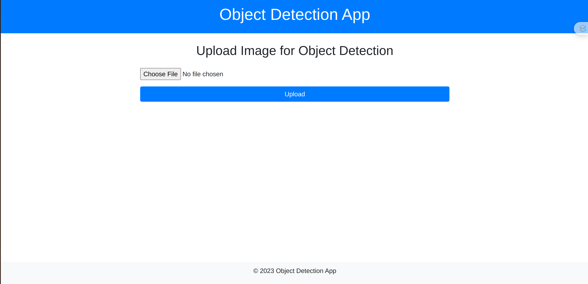

# Object Detection App

## Giới thiệu
Ứng dụng Object Detection App sử dụng mô hình YOLOv8 để phát hiện đối tượng trong hình ảnh. Người dùng có thể tải lên hình ảnh và nhận kết quả phát hiện với các bounding boxes và nhãn đối tượng.

## Cấu trúc dự án
```
__pycache__/
.gitignore
app.py
detect.py
requirements.txt
static/
    css/
        styles.css
    results/
templates/
    index.html
    results.html
uploads/
yolov8n.pt
```

## Các tệp và thư mục chính
- `app.py`: Tệp chính của ứng dụng Flask.
- `detect.py`: Chứa hàm `detect_objects` để phát hiện đối tượng trong hình ảnh.
- `requirements.txt`: Danh sách các thư viện cần thiết cho dự án.
- `static`: Thư mục chứa các tệp tĩnh như CSS và kết quả phát hiện.
  - `static/css/styles.css`: Tệp CSS cho giao diện người dùng.
  - `static/results/`: Thư mục chứa kết quả phát hiện.
- `templates`: Thư mục chứa các tệp HTML.
  - `templates/index.html`: Trang chủ của ứng dụng.
  - `templates/results.html`: Trang hiển thị kết quả phát hiện.
- `uploads`: Thư mục chứa các tệp hình ảnh được tải lên.
- `yolov8n.pt`: Tệp mô hình YOLOv8.

## Cài đặt
1. Clone repository:
    ```sh
    git clone <repository-url>
    cd <repository-directory>
    ```

2. Tạo môi trường ảo và cài đặt các thư viện cần thiết:
    ```sh
    python -m venv venv
    source venv/bin/activate  # Trên Windows: venv\Scripts\activate
    pip install -r requirements.txt
    ```

3. Chạy ứng dụng:
    ```sh
    python app.py
    ```

## Sử dụng
1. Mở trình duyệt và truy cập `http://127.0.0.1:5000/`.
2. Tải lên hình ảnh cần phát hiện đối tượng.
3. Xem kết quả phát hiện trên trang kết quả.

## Mô tả chi tiết các tệp
### 

app.py


- Khởi tạo ứng dụng Flask.
- Định nghĩa các route cho trang chủ và xử lý tải lên hình ảnh.
- Sử dụng hàm 

detect_objects

 để phát hiện đối tượng trong hình ảnh.

### 

detect.py


- Tải mô hình YOLOv8.
- Định nghĩa hàm 

detect_objects

 để phát hiện đối tượng trong hình ảnh và lưu kết quả.

### 

index.html


- Trang chủ của ứng dụng, cho phép người dùng tải lên hình ảnh.

### 

results.html


- Trang hiển thị kết quả phát hiện đối tượng.

### 

styles.css


- Tệp CSS cho giao diện người dùng.

## Đóng góp
Nếu bạn muốn đóng góp cho dự án, vui lòng tạo pull request hoặc mở issue trên GitHub.

## Giấy phép
Dự án này được cấp phép theo giấy phép MIT. Vui lòng xem tệp LICENSE để biết thêm chi tiết.